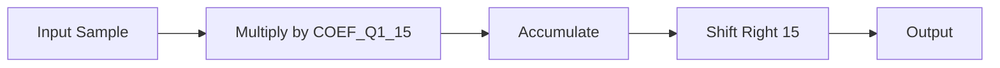

---
tags:
  - Лекция
Тема: 3.1. Системы счисления
Количество часов: 2
Номер занятия: 9
Состояние: Нужно усовершенствовать 
---

# Арифметические действия над числами с фиксированной запятой

## Цели и задачи лекции
1. Понять принципы представления чисел с фиксированной запятой в цифровой форме.  
2. Изучить основные арифметические операции (сложение, вычитание, умножение, деление) с этими числами.  
3. Научиться определять и устранять ошибки округления и переполнения.  
4. Применить полученные знания при проектировании простых вычислительных модулей.

## Ключевые понятия
- **Число с фиксированной запятой** – целое число, интерпретируемое как дробное с заданным положением запятой.  
- **Разрядность** – общее число битов, используемых для хранения числа.  
- **Класс фиксированной запятой** – тип, определяющий целую и дробную части (например, Q15.16).  
- **Округление** – метод выбора ближайшего представимого числа при потерях точности.  
- **Переполнение** – ситуация, когда результат операции выходит за диапазон допустимых значений.  
- **Промежуточный результат** – результат, хранящийся в расширенном разряде для избежания потери точности.  
- **Сдвиг** – операция, меняющая позицию запятой в числе (правая/левая).  
- **Соблюдение знака** – корректная работа с отрицательными числами в фиксированной запятой.  
- **Стабильность** – устойчивость операций к накоплению ошибок округления.  
- **Мультипликативная точность** – количество битов, сохраняемых при умножении.

## Основное содержание

### 1. Представление чисел с фиксированной запятой (15 мин)
- Формат Qm.n: m бит для целой части, n бит для дробной.  
- Пример: Q2.5 → 7‑битное число: 1 0101101.  
- Преобразование из десятичного в фиксированную запятую и обратно.  
- Таблица диапазонов для разных разрядностей.

### 2. Арифметические операции (30 мин)
#### 2.1 Сложение и вычитание (10 мин)
- Пошаговый алгоритм: выравнивание знаков, сложение битов, обработка переноса.  
- Пример кода на C++:
```cpp
int16_t add_q8_8(int16_t a, int16_t b) {
    int32_t temp = (int32_t)a + (int32_t)b; // промежуточный результат
    return (int16_t)temp; // обрезка к 16 битам
}
```
#### 2.2 Умножение (10 мин)
- Умножение как развернутая сумма с сдвигом.  
- Пример на C++:
```cpp
int16_t mul_q8_8(int16_t a, int16_t b) {
    int32_t temp = (int32_t)a * (int32_t)b; // 32‑битный результат
    temp >>= 8; // сдвиг для восстановления формата Q8.8
    return (int16_t)temp;
}
```
#### 2.3 Деление (10 мин)
- Увеличение делимого для сохранения точности.  
- Пример на C++:
```cpp
int16_t div_q8_8(int16_t a, int16_t b) {
    int32_t temp = ((int32_t)a << 8) / (int32_t)b;
    return (int16_t)temp;
}
```

### 3. Ошибки округления и переполнения (15 мин)
- Округление до ближайшего (round‑to‑nearest) vs. отбрасывание (truncate).  
- Пример: 1.2 (Q8.8) ≈ 0x0199, но после округления может стать 0x019A.  
- Обработка переполнения: флаги overflow, saturating arithmetic.  
- Практический пример: добавление двух больших чисел Q8.8.

### 4. Практическая часть – проект простого кода (20 мин)
- Задача: реализовать функцию фильтра FIR на фиксированной запятой.  
- Пошаговое описание: выбор коэффициентов, хранение в Q1.15, умножение и суммирование.  
- Код:
```cpp
#define COEF_Q1_15 0x4000 // 0.5
int16_t fir_filter(int16_t sample, int16_t *state) {
    int32_t acc = 0;
    for (int i = 0; i < 4; i++) {
        acc += (int32_t)sample * COEF_Q1_15;
        sample = state[i];
    }
    return (int16_t)(acc >> 15);
}
```
- Визуальная схема (Markdown блок):


## Выводы по лекции
- Числа с фиксированной запятой позволяют эффективно реализовывать арифметику в системах с ограниченными ресурсами.  
- Операции сложения, вычитания, умножения и деления требуют промежуточных разрядов и правильного сдвига.  
- Ошибки округления и переполнения можно контролировать с помощью флагов и алгоритмов saturating arithmetic.  
- Практика на примере FIR‑фильтра демонстрирует реальное применение фиксированной запятой в цифровой обработке сигналов.

## Вопросы для самопроверки
1. Что обозначает формат Qm.n и как вычисляется диапазон допустимых значений?  
2. Какой промежуточный разряд обычно используется при умножении чисел Q8.8?  
3. Опишите алгоритм деления в фиксированной запятой.  
4. Как реализовать saturating arithmetic при сложении Q1.15?  
5. Почему при делении необходимо увеличить делимое?  
6. Какой тип округления предпочтительнее при работе с цифровыми фильтрами?  
7. Приведите пример кода для сложения Q4.12.  
8. Какие проблемы могут возникнуть при вычитании больших отрицательных чисел в Q8.8?  
9. Как сдвиг влияет на позицию запятой?  
10. Что такое промежуточный результат и зачем он нужен?

## Рекомендуемая литература / источники
- Х. Дж. М. Грин, *Digital Signal Processing: Principles, Algorithms and Applications*, 4th ed., Pearson, 2012.  
- А. В. Петров, *Численные методы и цифровая обработка сигналов*, 3rd ed., Springer, 2018.  
- IEEE Std 1805-2005 – *Fixed-Point Arithmetic Standards*.  
- D. R. Smith, *Computer Architecture: A Quantitative Approach*, 5th ed., McGraw‑Hill, 2015.  
- J. R. Smith, *Digital Signal Processing in Embedded Systems*, 2nd ed., O’Reilly, 2019.

